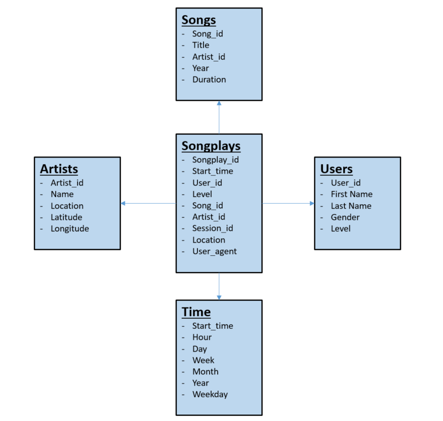

# Data Lake with Apache Spark

This Project creates a Data Lake by using spark and pyspark.
The source data consists of log files from a song streaming platform and is located in an AWS S3 bucket. The goal is to store the relevant information in a data lake consisting of parquet files for analytics purposes.

The final dimensional architecture follows the star schema and consist of one Fact Table (songplays) and four Dimension Tables (users,songs,artists and time).
The design is used to optimize for analytical queries and allows to efficiently store the data on S3.

## Project Files
The files in the repository are used as described below:

* dl.cfg : Configuration file used to access the AWS S3 Bucket.
* etl.py : ETL Script that is used to load and transform the data into the required format. It saves the resulting parquet files into the specified S3 bucket.
* requirements.txt: Lists the environment requirements.

## Final Database Schema Design:



## Datasets:

The used datasets are located on an S3 bucket and are stored in json format. 
The song_data is a subset from the [Million Song Dataset](http://millionsongdataset.com/) and the log_data contains streaming information of a music streaming platform.

## Environment Prerequisits
In order to run the ETL Pipeline and create the Data Lake the following prerequisits are required:

* Python 2.7 or greater
* AWS Account
* Set the AWS keys in the config file:

```
[AWS]
AWS_ACCESS_KEY_ID = <your aws key>
AWS_SECRET_ACCESS_KEY = <your aws secret>
```

## Installation and execution:
```
#install the requirments in your choosen developement environment
$ pip install -r requirements.txt

#run the etl pipeline
$ python etl.py
```